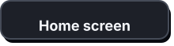
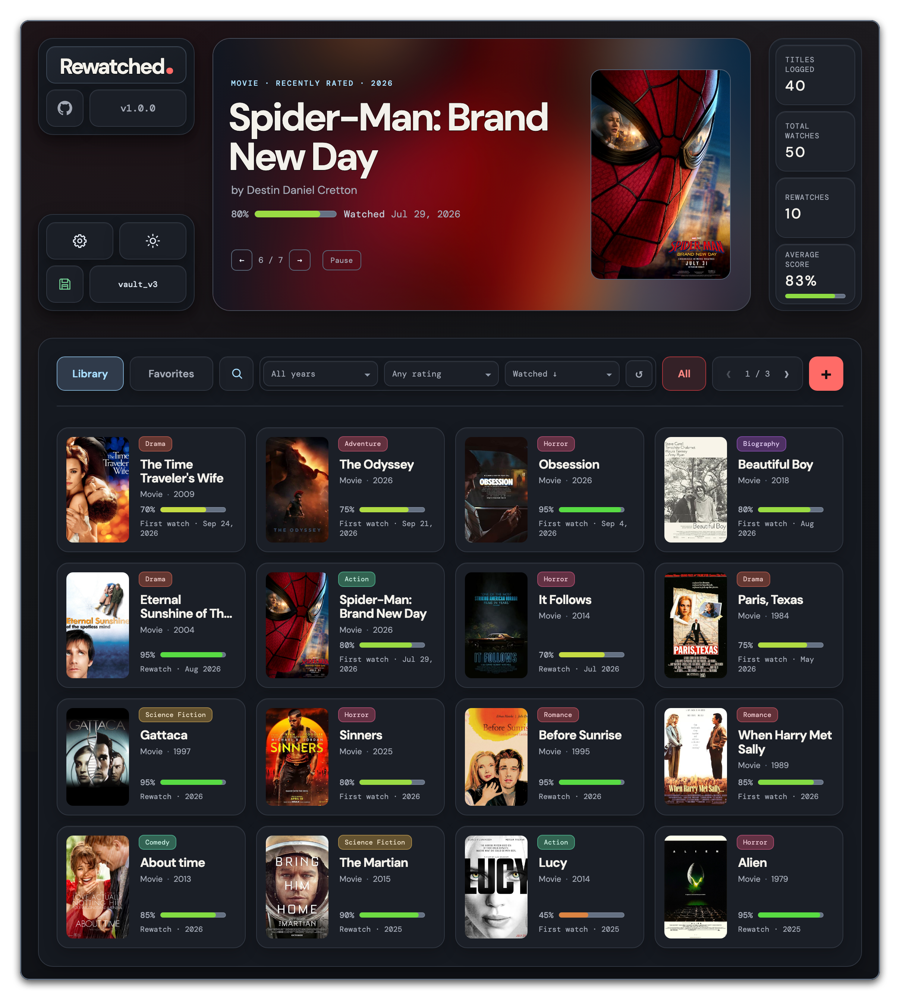
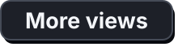
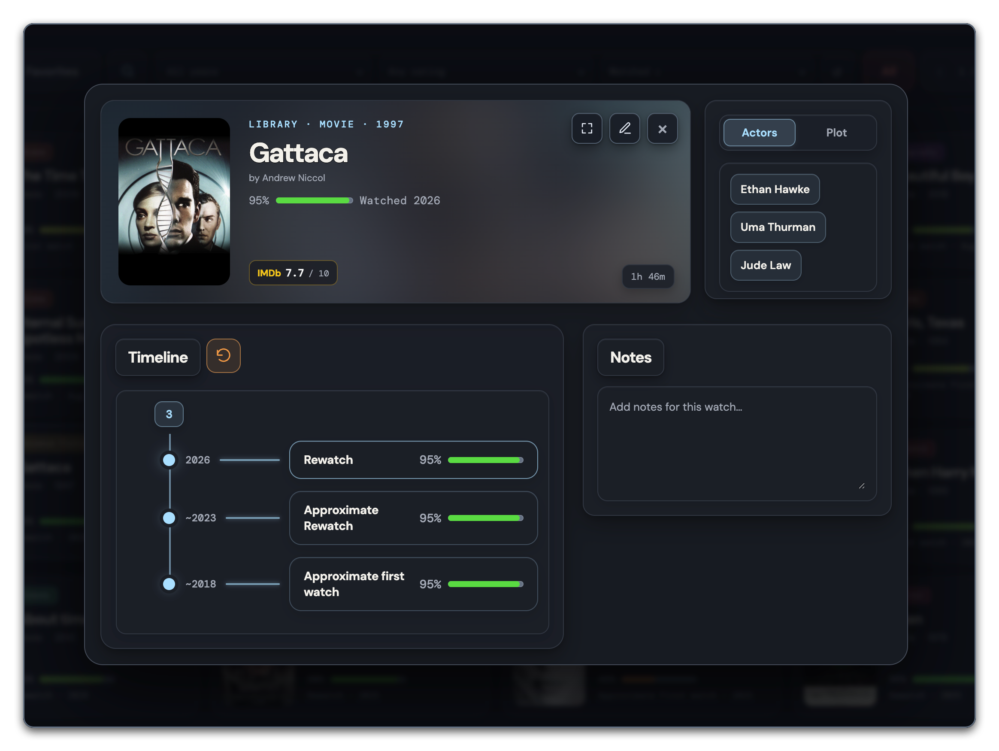
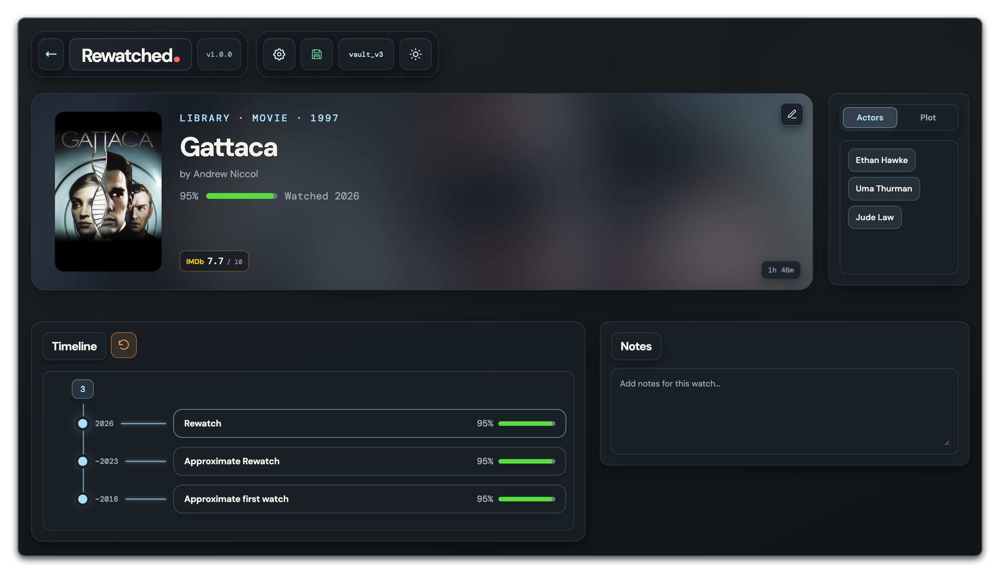

<p align="center">
  
  <br>A customizable watch journal for films and shows.
</p>

<p align="center"></p>

<p align="center"><a href="resources/app_preview.png"></a></p>

<p align="center"></p>

<p align="right"><a href="resources/details_hover_preview.png"></a></p>

<p align="left"><a href="resources/details_preview.png"></a></p>

## Keep your watching history

ReWatched is a customizable, desktop-friendly watch journal for keeping track of what you watch, when you watched it, and how you felt about it. Shape your library with folders, themes, and poster-based color effects, then add posters, log rewatches, and explore your history through timelines and statistics.

### What you can do

- Keep a library of watched films and shows, plus a separate watchlist with priorities.
- Record ratings, notes, and exact, approximate, or partial watch dates.
- Browse posters, search and filter entries, sort your collection, and organize titles into folders.
- Open each title’s page to see its timeline, notes, cast, plot, and saved IMDb details.
- View statistics for genres, ratings, rewatches, and watching years.
- Import and export JSON backups, or link a JSON file for automatic loading and saving.
- Choose light or dark appearance, including a subtle poster-based background effect.

## Run the app

You’ll need Node.js and npm. From the project folder, install dependencies and start Electron:

```sh
npm install
npm start
```

The app uses regular HTML, CSS, and JavaScript, so interface edits do not require a build step. While running in development, source changes reload the Electron window.

To run the web version, open `index.html` or serve the project folder locally:

```sh
python3 -m http.server 8000
```

Then visit <http://localhost:8000>.

## Your data

By default, entries are stored in the current browser’s local storage. You can export a JSON backup from Settings. In a supported browser, you can also select a JSON file in Settings and have changes save to it automatically. The Electron app uses the same interface and storage controls.

The app can optionally use Google Programmable Search for poster images and OMDb for movie details. Add those credentials in Settings if you want those features; fetched OMDb details are saved with the title.

## Project layout

```text
.
├── index.html          # Page markup and dialogs
├── app.js              # Startup, navigation, and event wiring
├── main.css            # Ordered imports for the stylesheets
├── css/                # Base styles and feature-specific styling
├── js/                 # State, views, forms, storage, and features
├── electron/           # Desktop application wrapper
└── uml/                # Editable architecture diagrams
```

The JavaScript files are loaded in order from `index.html` as deferred scripts. `js/state.js` provides shared application data and helpers; feature files build on those shared browser globals.

## Tools

- HTML, CSS, and vanilla JavaScript
- Electron
- Optional Google Programmable Search and OMDb APIs
